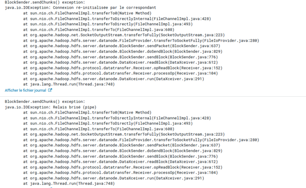

# technologie-issues-solves

Pour charger les données d'une base de données Oracle vers Hbase nous avons développé un Job Talend qui parcours les tables incrémentalement utilisant une clé primaire partager entre les tables, quand on lance le job talend sur un serveur distant des deux bases (Hbase et Oracle) les regions servers de hbase s'échoue après quelque mineutes de chargement.
Le volume de données est grand sans être intraitable, la description du cluster est visible sur les schémas suivants.

